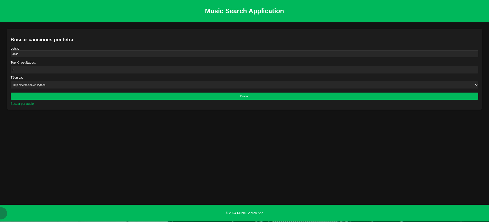
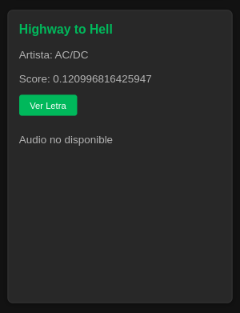
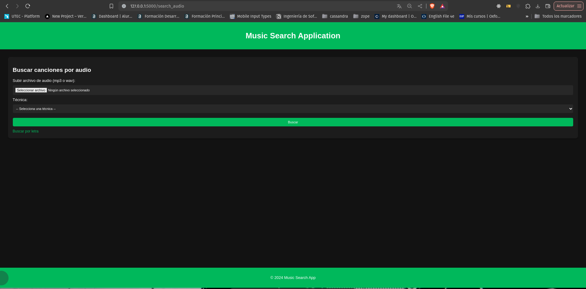
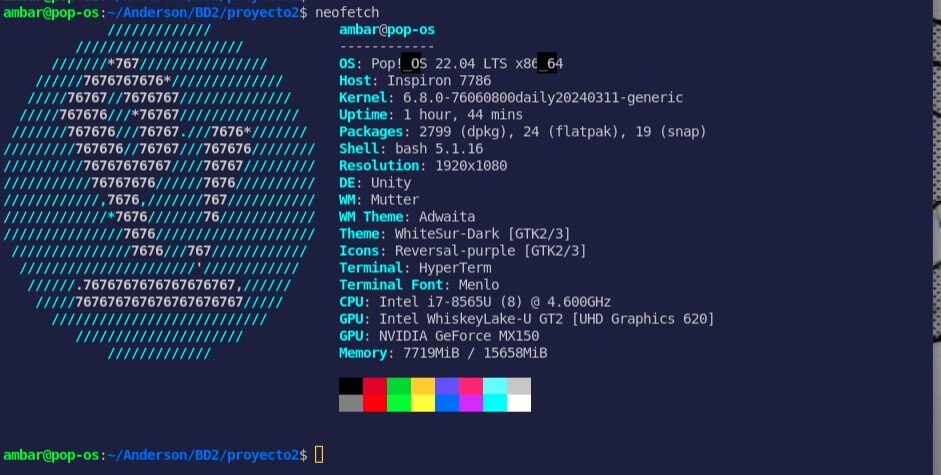
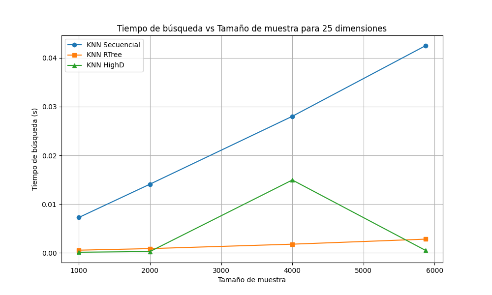
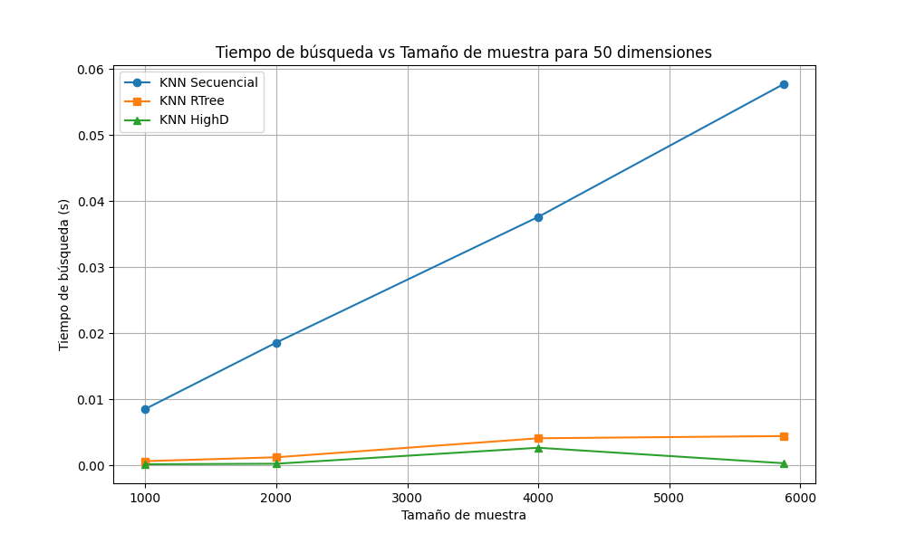
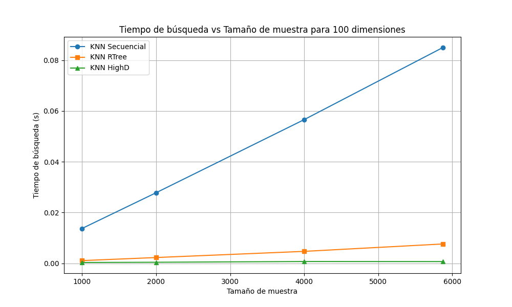
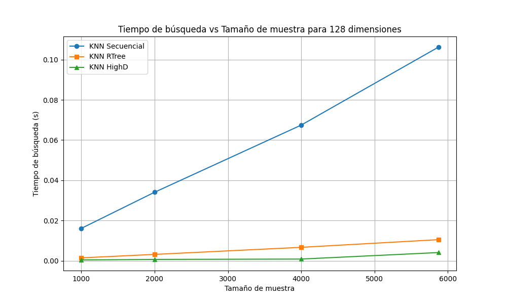

# Informe Proyecto 2 y 3 de Base de datos 2
# Integrantes
- Carlos Flores
- Cristopher Meneses
- Anderson Cárcamo
# Pasos para ejecutar el proyecto
1. Clonar el repositorio: `git clone git@github.com:ChuSebastian/P2_BD2.git`
2. Navegar al directorio del proyecto: `cd P2_BD2`
3. Instalar dependencias: `pip install -r requirements.txt`
4. Ejecutar la aplicación: `python src/app.py`

5. Recuerda mover las canciones a `frontend/static/audio`

# Introducción
En este proyecto, nos centramos en dos tipos de datos multimedia: texto y audio. Utilizando algoritmos eficientes y estructuras de datos avanzadas, hemos desarrollado un sistema capaz de realizar búsquedas rápidas y precisas en una colección de documentos y archivos de audio.

## Objetivo del proyecto
Respecto a la parte 1, aplicar algoritmos de búsqueda y recuperación de información en memoria secundaria.

Respecto a la parte 2, aplicar los algoritmos de búsqueda y recuperación de la información para archivos multimedia.

## Descripción del dominio de datos
La base de datos utilizada es [Audio features and lyrics of Spotify song](https://www.kaggle.com/datasets/imuhammad/audio-features-and-lyrics-of-spotify-songs). Para la primera parte se contó con alrededor de 18000 canciones y para la segunda parte con 5871 canciones.
|    **Variable**   |  **Class**  |  **Description**  |
|-------:|-------------:|-----------------:|
|   track_id  |        character |          Song unique ID |
|  track_name  |        0.character |          Song name |
|  track_artist  |        character |          Song artist |
|  lyrics  |        character |          Lyrics for the song |

Poner aqui importancia de aplicar indexación.

# Backend: Índice invertido
## Construcción del índice invertido en memoria secundaria

```pseudo
SPIMI_Invert(token_stream):
    output_file = NEWFILE()
    dictionary = NEWHASH()
    while (free memory avaible):
    do token = next(token_stream)
        if term(token) not in dictionary:
            then posting_list = AddToDictionary(dictionary,term(token))
            else posting_list = GetPostingsList(dictionary,term(token))
        if full (postings_list):
            then postings_list = DoublePostingsList(dictionary,term(token))
        AddToPostingsList(posting_list,docID(token))
    sorted_terms = SortTerms(dictionary)
    WriteBlockToDisk(sorted_terms,dictionary,output_file)
    return output_file

BSBIndexConstruction():
    n = 0
    while (all documents have not been processed):
    do
        n = n + 1
        token_stream = parseDocs()
        fn = SPIMI_Invert(token_stream)
    MergeBlocks(f1,...,fn;f_merged)
```

La clase `SPIMI` es responsable de implementar el algoritmo SPIMI para construir índices invertidos en bloques, escribirlos en disco y fusionarlos.
- Atributos:
1. `block_limit`: Limite de memoria para cada bloque.
2. `stop_words`: Lista de palabras que deben ser ignoradas durante la indexación.
3. `index_file_name`: Nombre del archivo final que contendrá el índice invertido fusionado.
- Métodos:
1. `WriteBLockToDisk`: Escribe un bloque del índice invertido en disco.
2. `spimi_invert`: Implementa el algoritmo SPIMI para un bloque.
3. `merge_blocks`: Fusiona múltiples bloques en un solo índice invertido.
4. `_spimi_index_construction`: Construye el índice invertido a partir de un archivo de flujo de tokens.
5. `create`: Inicia la construcción del índice invertido.

## Ejecución óptima de consultas aplicando Similitud de Coseno
La clase `IndexInverted` maneja la construcción del índice invertido en memoria secundaria, preprocesamiento de datos, escritura de normas en disco y la ejecución de consultas utilizando la similitud de coseno.
- Atributos:
1. `file_name_data`: Nombre del archivo de datos.
2. `number_of_tracks`: Numero de documentos (tracks).
3. `block_limit`: Límite de tamaño de bloque.
4. `stop_words`: Indica si se deben omitir palabras vacias. 
- Métodos:
5. `create_index_inverted`: Crea el índice invertido, llama a los métodos de preprocesamiento y escritura de normas en disco.
6. `load_index`: Carga el índice invertido desde un archivo.
7. `write_norm_to_disk`: Calcula y escribe las normas de los documentos en un archivo binario.
8. `search_term`: Busca la lista de postings de un término en el índice invertido.
9. `search_norm`: Busca la norma de un documento (track_id) en el archivo binario de normas.
10. `cosine_similarity`: Calcula la similitud del coseno entre la consulta y los documentos en el índice.
## ¿Cómo se construye el índice invertido en PostgreSQL?
La construcción de un índice invertido en PostgreSQL, especialmente para el caso de texto completo en campos como nombres de pistas, artistas y letras de canciones, se realiza generalmente a través de vectores de texto (tsvector) y consultas de texto (tsquery), utilizando la funcionalidad de búsqueda de texto completo que ofrece PostgreSQL. A continuación, te explico paso a paso cómo se construye y utiliza este índice invertido en tu ejemplo.

### Creación de la tabla
- Primero, creas una tabla llamada track que incluirá las columnas track_id, track_name, track_artist, y lyrics. Cada columna se define para almacenar texto.

```python
CREATE TABLE IF NOT EXISTS track(
    track_id TEXT,
    track_name TEXT,
    track_artist TEXT,
    lyrics TEXT
);
```
</p>

### Carga de datos
- Los datos se cargan en la tabla desde un archivo CSV. Este archivo debe estar ubicado en el servidor de PostgreSQL y el usuario de la base de datos debe tener los permisos adecuados para leerlo.
  
```python
COPY track FROM '/tmp/spotify_songs.csv' DELIMITER ',' CSV HEADER;
```

### Habilitación de extensiones
- PostgreSQL admite extensiones que proporcionan funcionalidades adicionales. pg_trgm es una extensión que proporciona funciones y operadores para determinar la similitud de cadenas de texto basadas en trigramas, aunque en este caso particular, la extensión relevante es más probable que se relacione con funcionalidades de búsqueda de texto completo.
```python
CREATE EXTENSION IF NOT EXISTS pg_trgm;
```

### Adición de una columna indexed y población de la misma
- Se añade una nueva columna indexed de tipo tsvector a la tabla track. Esta columna almacenará los vectores de texto que son esenciales para las búsquedas de texto completo.
```python
ALTER TABLE track ADD COLUMN indexed tsvector;
UPDATE track SET 
    indexed = x.indexed 
FROM (
    SELECT track_id,
            setweight(to_tsvector('english', track_name),'A') ||
            setweight(to_tsvector('english', track_artist), 'B') ||
            setweight(to_tsvector('english', lyrics), 'C') 
            AS indexed 
    FROM track
) AS x 
WHERE track.track_id = x.track_id;
```
En este bloque de código, cada campo de texto (track_name, track_artist, lyrics) es convertido a un tsvector con diferentes ponderaciones (A, B, C) que pueden ser utilizadas para dar más o menos importancia a cada campo en las búsquedas.

### Creación del índice
- Se crea un índice utilizando el método GIN (Generalized Inverted Index) sobre la columna indexed. Los índices GIN son particularmente efectivos para manejar datos que contienen múltiples valores en una sola columna (como vectores de texto).
  particular, la extensión relevante es más probable que se relacione con funcionalidades de búsqueda de texto completo.
```python
CREATE INDEX IF NOT EXISTS lyrics_idx_gin ON track USING gin(indexed);
```

### Búsqueda y recuperación de datos
- Para buscar en los datos, se ajusta una configuración para deshabilitar las búsquedas secuenciales, lo cual fuerza a PostgreSQL a utilizar el índice GIN.
```python
SET enable_seqscan TO OFF;
SELECT ts_rank_cd(indexed, query) AS rank, track_id, track_name, track_artist, lyrics
FROM track, plainto_tsquery('english', 'the trees') query
WHERE query @@ indexed
ORDER BY rank DESC LIMIT 100;
```
- plainto_tsquery convierte una cadena de texto plano en una consulta de texto completo, y @@ es el operador que encuentra los documentos que coinciden con la consulta. ts_rank_cd calcula un ranking de los documentos basado en la coincidencia.
- Finalmente, se restablecen las configuraciones al estado normal para permitir que PostgreSQL optimice las búsquedas de la manera habitual.

# Backend: Índice multidimensional
## Ténicas de indexación utilizadas

### KNN Secuencial y Range Search
```pseudo
class KNN_Sequential:
    constructor(collection):
        this.collection = collection

    method knn_heap_query(query_mfcc, k):
        result_heap = new OptimizedHeap()
        
        for track_id, mfcc in this.collection:
            dist = calculate_distance(mfcc, query_mfcc)
            node = new DistanceNode(distance=dist, track_id=track_id)
            if result_heap.size() < k:
                result_heap.push(node)
            elif result_heap.top().distance > dist:
                result_heap.replace_top(node)

        return [(node.track_id, node.distance) for node in result_heap.heapsort()]

    method range_query(query_mfcc, r):
        result = []
        for track_id, mfcc in this.collection:
            dist = calculate_distance(mfcc, query_mfcc)
            if dist < r:
                result.append((track_id, dist))
        
        return sort_by_distance(result)
```
La técnica KNN sequential es una implementación directa y optimizada del algoritmo K-Nearest Neighbors utilizando un heap para mantener los k vecinos más cercanos. Este enfoque es sencillo pero eficaz para pequeñas colecciones de datos. 

**Descripción:**
- **Heap optimizado:** Utiliza un heap optimizado para mantener los k vecinos más cercanos.
- **Búsqueda secuencial:** Realiza una búsqueda secuencial simple pero eficiente a través de la colección de datos.
### KNN Rtree
```pseudo
class KNN_RTree:
    constructor(m, collection):
        properties = set_properties(dimension=get_dimension(collection))
        index = create_rtree_index(properties)
        for i in range(len(collection)):
            coordinates = get_coordinates(collection[i])
            index.insert(id=i, coordinates=coordinates)

    method query(query_mfcc, k):
        coordinates = format_coordinates(query_mfcc)
        nearest = index.nearest(coordinates, num_results=k)
        result = []
        for item_id in nearest:
            obj = collection[item_id]
            result.append((obj.id, calculate_distance(obj, query_mfcc)))
        return result
```
La técnica KNN_RTree se basa en el uso de R-Trees, una estructura de datos que permite la búsqueda espacial eficiente. Este enfoque es ideal para manejar datos multidimensionales como las características de audio.

**Descripción:**
- **R-Tree:** Utiliza una estructura de R-Tree para indexar los vectores de características.
- **Búsqueda espacial:** Realiza búsquedas eficientes en el espacio de características utilizando el índice R-Tree.
### KNN HighD
```pseudo
class KNN_HighD:
    constructor(num_bits, collection):
        dimension = get_dimension(collection)
        index = faiss.IndexLSH(dimension, num_bits)
        index.add(collection)

    method knn_query(query_mfcc, k):
        query_mfcc = format_query(query_mfcc)
        ranking, id_array = index.search(query_mfcc, k)

        result = []
        for idx in id_array:
            if idx == -1:
                continue
            obj = collection[idx]
            dist = calculate_distance(obj, query_mfcc)
            result.append((obj.id, dist))
        return sort_by_distance(result)
```
La técnica KNN_HighD utiliza la biblioteca FAISS (Facebook AI Similarity Search) para manejar la búsqueda en espacios de alta dimensión de manera eficiente. FAISS es especialmente útil para trabajar con grandes colecciones de datos y proporciona estructuras de datos optimizadas para la búsqueda de similitud.
**Descripción:**
- **FAISS IndexLSH:** Utiliza un índice de Locality Sensitive Hashing (LSH) para buscar en espacios de alta dimensión.
- **Búsqueda eficiente:** Realiza búsquedas rápidas utilizando FAISS, devolviendo los k elementos más cercanos a la consulta.

## Ánalisis de la maldición de la dimensionalidad
La maldición de la dimensionalidad plantea desafíos significativos para los algoritmos de búsqueda como KNN y Range Search, debido al aumento de la distancia entre puntos, la homogeneización de las distancias y la dispersión de los datos en espacios de alta dimensión. Sin embargo, mediante la reducción y selección de dimensiones, así como la normalización de datos, es posible mitigar algunos de estos efectos y mejorar el rendimiento de estos algoritmos. 
# Fronted parte 1


# Fronted parte 2
Inicialmente se puede visualizar un formulario para una busqueda por letra, titulo y autor de una canción.

Se solicita:

- Letra/autor/título:ejemplo -> "acdc"
- k: cantidad de resultados esperados -> 8
- Técnica: Prueba para la implementación en Python o postgresql -> integracion en python




Una vez rellenado, si se presiona "Buscar" se obtiene:


Dentro de esta imágen se visualiza los `8` k valores solicitados que se parezcan a la query introducida.

En cada card se visualiza:


Donde podemos observar el audio siempre y cuando esté disponible. Sino en todo no se mostraría el audio ni tampoco opción de busqueda por dicho audio:



En caso en index hayamos presionado buscar por audio, vamos a poder subir un audio para encontrar similares a el.



Se cuenta con tres técnicas a elección.

- KNN secuencial
- KNN RTree
- KNN HighD

En caso hayamos seleccionado Secuencial, podremos visualizar las opciones de búsqueda por k (cantidad de vecinos) o por R (radio).


*En el caso de radio, al ser un knnSequential dicho radio puede traer 0 canciones ante un valor pequeño y traer demasiados ante un valor grande.*

Donde podemos observar según la busqueda, el tiempo de ejecución de la consulta, El trackID que se utilizado. Y las canciones en cartas. Donde podemos escuchar una preview de la canción, nombre, un grado de similitud con la canción query.


Dentro de cada card también podemos hacer una busqueda por canción, seleccionando la técnica y el top k en el caso del highD y Rtree o el radio o k en el caso del secuencial.


## Ánalisis comparativo visual con otras implementaciones

# Experimentación
## Parte 1
La experimentación depende mucho de la computadora en ejecución. En este caso los parámetros de la máquina:



### Calculo del mejor blocket_limit

El blocket limit lo definimos como el tamaño máximo de datos que se permite almacenar en memoria antes de escribir un bloque en disco.

Para este parametro vamos a considerar **PAGE_SIZE** y la cantidad de momoria asignada.

Entonces:

```shell
getcong PAGE_SIZE
```

Este comando nos va a botar un tamaño de página de 4096

La memoria asignada va a ser de **1GB**.

### Pruebas con Variación en N datos

Parámetros:

- Query de consulta: "All around me are familiar faces Worn-out places"
- Blocket_Limit: memory_to_use // page_size

Tabla con datos obtenidos:

|    N   |  PostgreSQL  |  Implementacion  |
|-------:|-------------:|-----------------:|
|   100  |        0.128 |          0.428033 |
|  1000  |        0.097 |          2.046529 |
|  2000  |        0.127 |          3.185042 |
|  4000  |        0.089 |          7.082197 |
|  8000  |        0.083 |         17.902043 |
| 16000  |        0.521 |         47.720579 |
| 32000  |        0.215 |         79.181657 |
| 64000  |        0.851 |        260.905411 |


Los tiempos obtenidos con la implementación son lentos debidos a la computadora donde se ha hecho el experimento, esto se prueba con la practica del frontend donde los tiempos han sido iguales o menores a postgresql.

# Parte 2

Para la experimentación se ha realizado pruebas variando la cantidad de dimensiones obtenidas de cada canción. Dichas dimensiones son los mfcc que se han obtenido con la libreria de `librosa`.

## Análisis con 25 dimensiones

### Tabla:

| Size | KNN Sequential | KNN HighD       | KNN RTree        |
|------|----------------|-----------------|------------------|
| 1000 | 0.007271       | 0.000145        | 0.000566         |
| 2000 | 0.014108       | 0.000289        | 0.000888         |
| 400  | 0.028023       | 0.014958        | 0.001795         |
| 5871 | 0.042497       | 0.000529        | 0.002825         |

### Gráfico:



Se visualiza una tendencia lineal para la busqueda secuencial. Y vemos que tiene un tiempo mayor a los otros dos métodos. Esto es esperado pues realiza una comparación directa con cada elemento.

Además notamos una clara ventaja de los otros métodos. Notando hasta una tendencia constante para el RTree. En el caso del highD vemos que hay un tope en los tiempos cuando empieza a hacerse mucho más eficiente. Siendo entonces ventajoso el uso de un rtree para una población baja de datos.

## Análisis con 50 dimensiones

### Tabla:

| Size | KNN Sequential | KNN HighD       | KNN RTree        |
|------|----------------|-----------------|------------------|
| 1000 | 0.008562       | 0.000205        | 0.000680         |
| 2000 | 0.018610       | 0.000288        | 0.001262         |
| 400  | 0.037626       | 0.002703        | 0.004136         |
| 5871 | 0.057702       | 0.000363        | 0.004472         |

### Gráfico:



Al igual que el gŕafico anterior. El secuencial se observa claramente muy desventajoso. También se visualiza que el pico anomalo del highD cuando se han aumentado las dimensiones se ha suavizado y vemos que empieza a hacerse ligeramente más eficiente que el rtree.

## Análisis con 100 dimensiones

### Tabla:

| Size | KNN Sequential | KNN HighD       | KNN RTree        |
|------|----------------|-----------------|------------------|
| 1000 | 0.013713       | 0.000317        | 0.001062         |
| 2000 | 0.027793       | 0.000410        | 0.002268         |
| 400  | 0.056598       | 0.000700        | 0.004696         |
| 5871 | 0.084970       | 0.000677        | 0.007609         |

### Gráfico:



En este gráfico. Vemos claramente que se mantiene la desventaja del secuencial. Además que el highD empieza a ser ventajo ante una cantidad grande de dimensiones, siendo casi constante el tiempo de ejecución de la consulta. Vemos que el pico que se observaba para el highD ya no es relevante y que el highD presenta una ventaja ante el rtree.

## Análisis con 128 dimensiones

### Tabla:

| Size | KNN Sequential | KNN HighD       | KNN RTree        |
|------|----------------|-----------------|------------------|
| 1000 | 0.016078       | 0.000409        | 0.001433         |
| 2000 | 0.034067       | 0.000667        | 0.003155         |
| 400  | 0.067464       | 0.000838        | 0.006668         |
| 5871 | 0.106231       | 0.004074        | 0.010487         |


### Gráfico:



En un aumento de dimensiones se visualiza que ya no existe el pico que se denotaba anteriormente en el RTree. Además, se presenta una ventaja más notoria, con respecto a los anteriores gráficos, por parte del HighD ante el RTree. Y empezamos a notar un aumento leve del highD a partir de más datos.

### Notas:

- Puede exisitir sesgo al tener una cantidad baja de datos de 5871.

## Análisis y discusión.

1. En este proyecto, hemos implementado tres técnicas diferentes para realizar búsquedas KNN en datos multimedia. Cada técnica tiene sus ventajas y desventajas dependiendo del tamaño de la colección y las dimensiones de los datos. Mientras que KNN_Sequential es simple y fácil de implementar, KNN_RTree y KNN_HighD proporcionan soluciones más eficientes para grandes colecciones de datos y espacios de alta dimensión.

2. Estas técnicas no solo mejoran la precisión y rapidez de las búsquedas, sino que también muestran cómo diferentes estructuras de datos y algoritmos pueden ser aplicados para optimizar la recuperación de información en distintos contextos.

3. Hemos notado una clara ventaja por parte de las técnicas de HighD y RTree. Donde se ha hecho notario ante el aumento de datos multimedia.

4. Ante el aumento de dimensiones el KNNHighD ha sido el mejor optmizado opteniendo tiempos de ejecución bajos y, mejores que el RTree. Siendo este la mejor opción para busquedas de datos multimedia y con el uso de grandes dimensiones.
